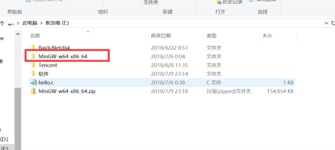
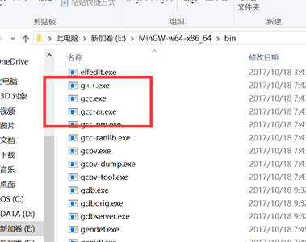
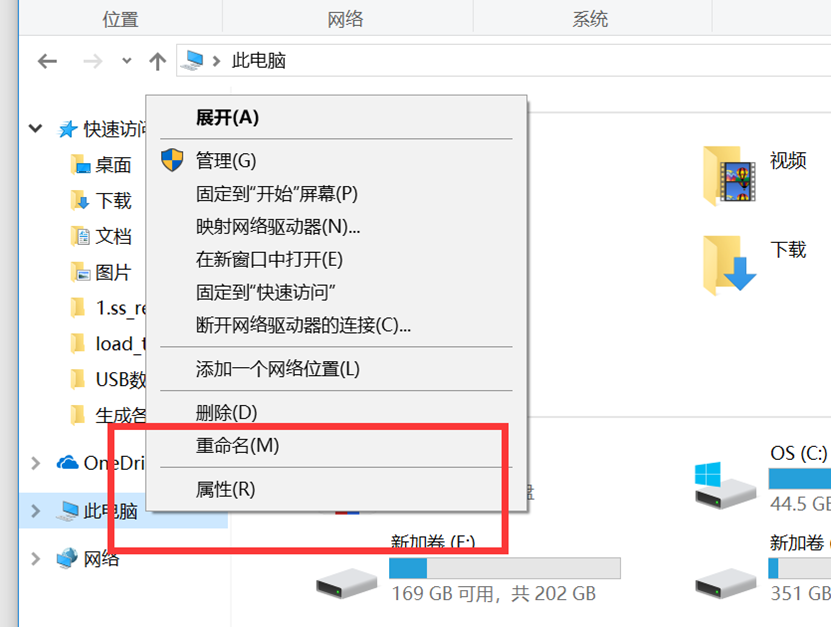
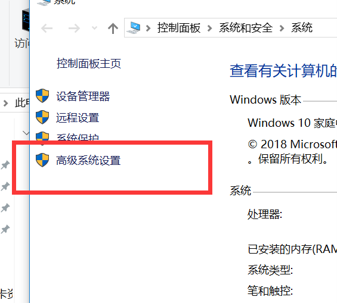
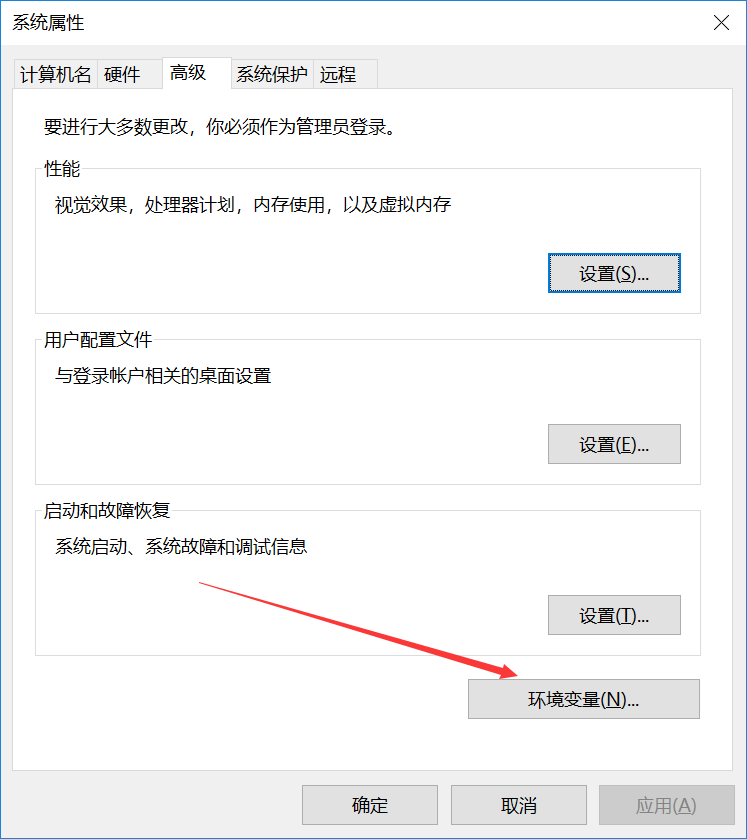
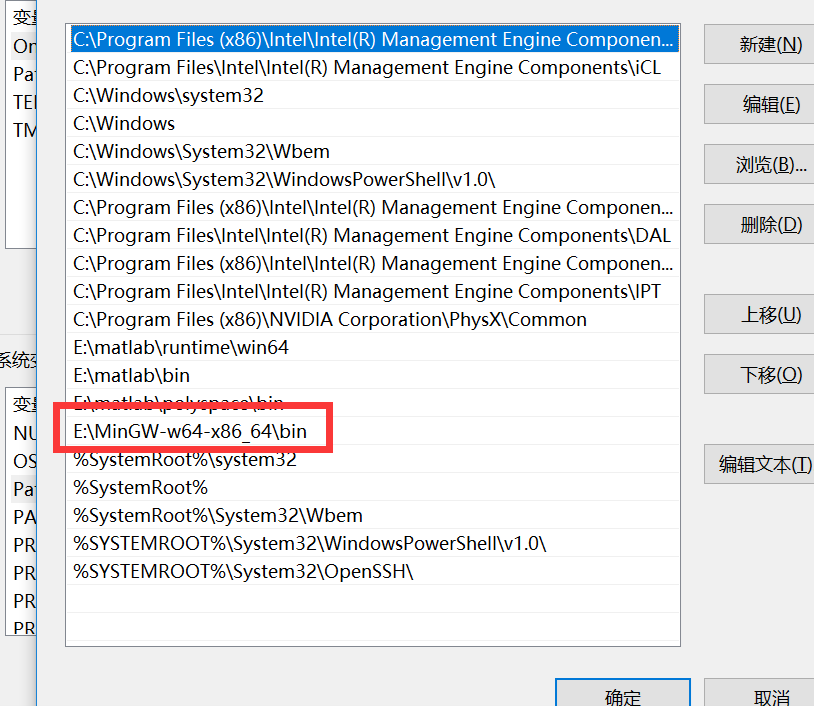
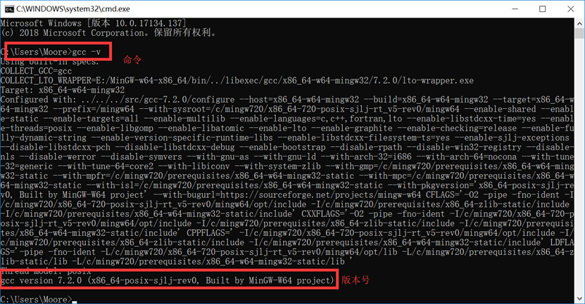
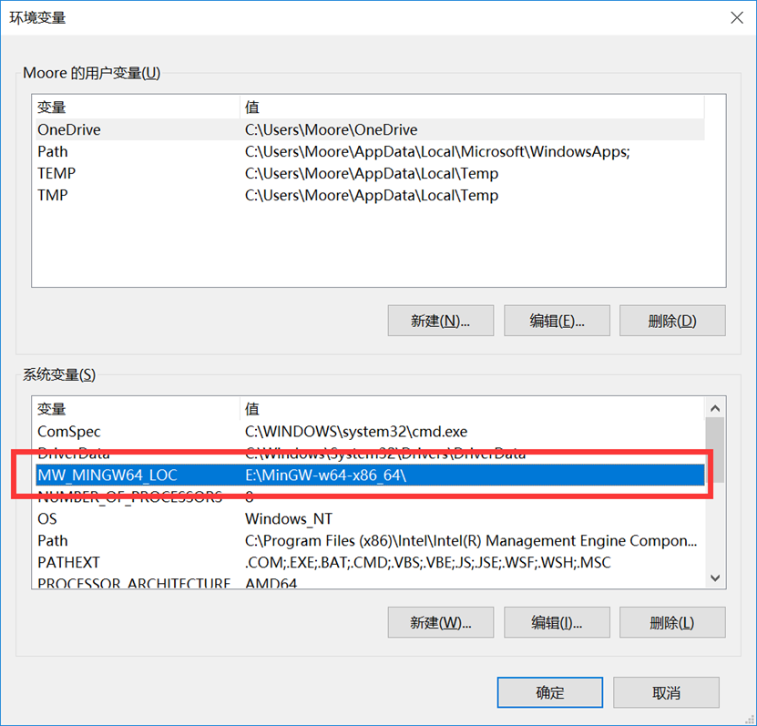

# MATLAB与C的交叉编译

历史文档

## 1 C编译器的安装配置

<figure align = center>
    
    
</figure>

<figure align = center>
    
    
</figure>

<figure align = center>
    
    
</figure>

记住或者手动保存上面输入的环境变量地址。



## 2 MATLAB可读环境变量的配置



如上设置环境变量名，并在命令行中键入

```matlab
setenv('MW_WINGW64_LOC', 'E\MinGW-w64-x86_64')
```

设置GCC。随后键入

```matlab
mex -setup
```

若返回对应的编译器，则配置成功。

## 3 动态链接库编译测试

在命令行中键入

```matlab
loadlibrary('test')
x = calllib('test', 'add', 1, 1)
```

若返回计算结果'2'，则编译成功。

## 参考资料

https://blog.csdn.net/desire121/article/details/60466845

https://blog.csdn.net/autumn20080101/article/details/52831367

https://blog.csdn.net/ucas_123/article/details/51924565