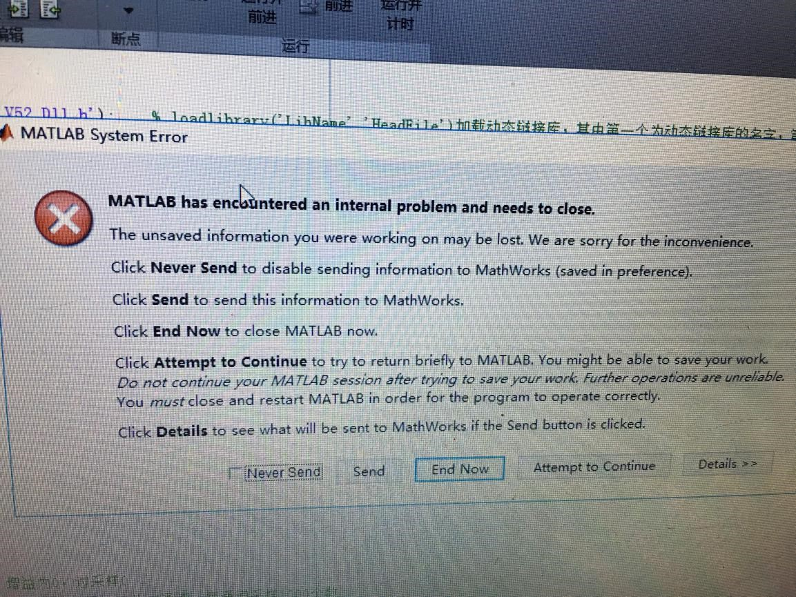

# Q&A记录

## 未配置编译器

MATLAB读取采集卡数据时，要先确定自己的MATLAB中有没有外部编译器，一般装过VC（vs）的（安装时会有）基本上都可以，在MATLAB中输入命令mex –setup 可以查看自己的MATLAB中是否有外部编译器

## 驱动安装失败

[Windows10 不能安装采集卡驱动的解决方案](https://jingyan.baidu.com/article/375c8e19c2b25b25f2a229a3.html)

## 未找到库问题

错误使用 [**calllib**](matlab:matlab.lang.internal.introspective.errorDocCallback('calllib'))
未找到库

出错 [**usb_daq_acquire**](matlab:matlab.lang.internal.introspective.errorDocCallback('usb_daq_acquire', 'D:\Desktop\matlab_USB_DAQ\functions\usb_daq_acquire.m', 37))
        result = calllib('Usb_Daq_V52_Dll','openUSB');
                 ^^^^^^^^^^^^^^^^^^^^^^^^^^^^^^^^^^^^

## MATLAB崩溃问题

+ 第一步：可以关闭程序，拔下采集板卡电，重新运行一下
+ 第二步：可以尝试重新安装一下板卡驱动
+ 第三步：……

